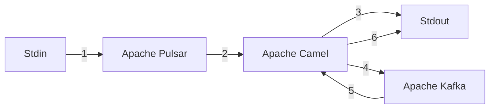
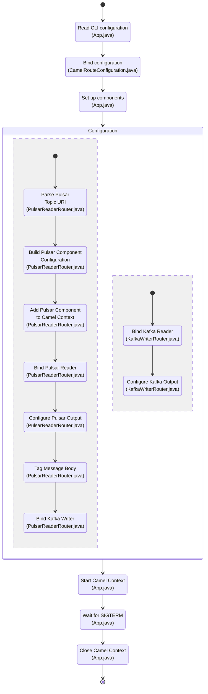

# ApacheCamelTest

## Overview

This project is designed to demonstrate how to connect [Apache Pulsar](https://pulsar.apache.org/) to [Apache Kafka](https://kafka.apache.org/) using [Apache Camel](https://camel.apache.org/) as an intermediary. Apache Camel is a framework that implements [Enterprise Integration Patterns](https://www.enterpriseintegrationpatterns.com/toc.html) as defined by Gregor Hohpe and Bobby Woolf in [the book of the same name](https://www.amazon.com/Enterprise-Integration-Patterns-Designing-Deploying/dp/0321200683/).

The following illustrations maps out the messaging flow:



The steps are described below:

1. A user types a message using the Apache Pulsar client application to initiate a message to a Pulsar topic.

2. The message is picked up from the Pulsar topic by Apache Camel.

3. Camel writes out Pulsar message-related details to the user.

4. The message is tagged with `<Pulsar Tag>` to indicate that Pulsar processed it and it is delivered to an Apache Kafka topic for additional processing.

5. Camel picks the message up from Kafka.

6. Camel writes out Kafka message-related details to the user and discards the message.

The application flow is as follows:



## Prerequisites

In order to build and run the demo, you'll need the following software installed:

- Java (I used [Microsoft's build of `openjdk 11.0.12`](https://docs.microsoft.com/en-us/java/openjdk/older-releases#openjdk-11012))
- [Apache Maven](https://maven.apache.org/download.cgi)
- [Apache Pulsar](https://pulsar.apache.org/download/)

If you're planning on using container integration, you'll also need some kind of container infrastructure. (This documentation assumes you're using Docker, but any container infrastructure will work.)

Make sure that Java and Maven are configured properly on your machine, including any necessary adjustments to the system path.

## Building and Running

To build the application, run the following command from the `apachecameltest` directory:

`mvn clean install compile assembly:single`

This will produce a file named `apachecameltest\target\apachecameltest-1.0-SNAPSHOT-jar-with-dependencies.jar`

You can then run the application from the command line with:

`java -jar apachecameltest\target\apachecameltest-1.0-SNAPSHOT-jar-with-dependencies.jar <PULSAR_TOPIC> <KAFKA_TOPIC>`

where

- `<PULSAR_TOPIC>` is of the format `
{persistent|non-persistent}://tenant/namespace/topic
` per the [official documentation](https://pulsar.apache.org/docs/pulsar-2.0/#no-cluster-component)

- `<KAFKA_TOPIC>` is at a minimum of the form `<TOPIC_NAME>?brokers=<BROKER>` where
  - `<TOPIC_NAME>` is the name of the topic
  - `<BROKER>` is the server to which the topic is bound

## Testing the Application

The easiest way to test is the use the `pulsar-client` application that is bundled with the Pulsar install. To use it, open a Bash terminal and navigate to the `apache-pulsar-X.Y.Z/bin` directory where the `pulsar-client` application is housed. Running the application is pretty simple; just run:

`./pulsar-client produce "<PULSAR_TOPIC>" -m "<MESSAGES>"`

where

- `<PULSAR_TOPIC>` is the topic that the Camel application will listen to
- `<MESSAGES>` is a comma-delimited collection of messages that are intended to be passed to Pulsar

For example, when the application is run and the following command is executed:

`./pulsar-client produce "persistent://localhost:6650/public/default/outbound-topic" -m "Hello,World!"`

output generated by `pulsar-client` will be similar to:

```
yyyy-mm-ddThh:mm:ss,789-0400 [main] INFO  org.apache.pulsar.client.impl.ProducerStatsRecorderImpl - [persistent://localhost:6650/public/default/outbound-topic] [standalone-0-1] Pending messages: 0 --- Publish throughput: 11.03 msg/s --- 0.00 Mbit/s --- Latency: med: 83.000 ms - 95pct: 83.000 ms - 99pct: 83.000 ms - 99.9pct: 83.000 ms - max: 83.000 ms --- BatchSize: med: 1.000 - 95pct: 1.000 - 99pct: 1.000 - 99.9pct: 1.000 - max: 1.000 --- MsgSize: med: 6.000 bytes - 95pct: 6.000 bytes - 99pct: 6.000 bytes - 99.9pct: 6.000 bytes - max: 6.000 bytes --- Ack received rate: 11.03 ack/s --- Failed messages: 0
yyyy-mm-ddThh:mm:ss,799-0400 [pulsar-client-io-1-1] INFO  org.apache.pulsar.client.impl.ProducerImpl - [persistent://localhost:6650/public/default/outbound-topic] [standalone-0-1] Closed Producer
yyyy-mm-ddThh:mm:ss,812-0400 [pulsar-client-io-1-1] INFO  org.apache.pulsar.client.impl.ClientCnx - [id: 0x8e3f3663, L:/127.0.0.1:33426 ! R:localhost/127.0.0.1:6650] Disconnected
yyyy-mm-ddThh:mm:ss,837-0400 [main] INFO  org.apache.pulsar.client.cli.PulsarClientTool - 2 messages successfully produced
```
and output generated by the Camel application will be similar to:

```
[pulsar-external-listener-3-1] INFO route2 - Message received from Pulsar : Hello
[pulsar-external-listener-3-1] INFO route2 -     on the topic persistent://localhost:6650/public/default/outbound-topic
[pulsar-external-listener-3-1] INFO route2 -     published at 1655127711701
[pulsar-external-listener-3-1] INFO route2 -     from the producer standalone-0-1
[pulsar-external-listener-3-1] INFO route2 - Message received from Pulsar : World!
[pulsar-external-listener-3-1] INFO route2 -     on the topic persistent://localhost:6650/public/default/outbound-topic
[pulsar-external-listener-3-1] INFO route2 -     published at 1655127711775
[pulsar-external-listener-3-1] INFO route2 -     from the producer standalone-0-1
[Camel (camel-1) thread #1 - KafkaConsumer[inbound-topic]] INFO route1 - Message received from Kafka : <Pulsar Tag> Hello
[Camel (camel-1) thread #1 - KafkaConsumer[inbound-topic]] INFO route1 -     on the topic inbound-topic
[Camel (camel-1) thread #1 - KafkaConsumer[inbound-topic]] INFO route1 -     on the partition 0
[Camel (camel-1) thread #1 - KafkaConsumer[inbound-topic]] INFO route1 -     with the offset 0
[Camel (camel-1) thread #1 - KafkaConsumer[inbound-topic]] INFO route1 -     with the key Pulsar
[Camel (camel-1) thread #1 - KafkaConsumer[inbound-topic]] INFO route1 - Message received from Kafka : <Pulsar Tag> World!
[Camel (camel-1) thread #1 - KafkaConsumer[inbound-topic]] INFO route1 -     on the topic inbound-topic
[Camel (camel-1) thread #1 - KafkaConsumer[inbound-topic]] INFO route1 -     on the partition 0
[Camel (camel-1) thread #1 - KafkaConsumer[inbound-topic]] INFO route1 -     with the offset 1
[Camel (camel-1) thread #1 - KafkaConsumer[inbound-topic]] INFO route1 -     with the key Pulsar
```

## Convenience Scripts

To make life easier, there are a couple of convenience Bash scripts for building and running the application:

- `build\build-project.sh`: This script runs the necessary build commands without needing to know the underlying Maven commands.

- `build\build-project-and-run.sh <PULSAR_TOPIC> <KAFKA_TOPIC>`: This script runs `build-project.sh` and runs the built `apachecameltest-1.0-SNAPSHOT-jar-with-dependencies.jar` with the supplied Pulsar and Kafka topics.

When running them, make sure you're in the `build` directory so the relative paths work.

Additionally, if you're using Visual Studio Code, the workspace file included (`.vscode\ApacheCamelTest.code-workspace`) has the necessary configuration to run the project from the Debug interface instead of the CLI using the following defaults:

  - `<PULSAR_TOPIC>`: `persistent://localhost:6650/public/default/outbound-topic`
  - `<KAFKA_TOPIC>`: `inbound-topic?brokers=localhost:9092`

These defaults indicate:

- The host system is `localhost`.
- The Pulsar topic is persistent.
- The Pulsar cluster is running on its default port, `6650`.
- The Pulsar namespace is `public/default`, which is a default namespace provided when running a Pulsar cluster in standalone mode.
- The Pulsar topic is named `outbound-topic`.
- The Kafka topic is named `inbound-topic`.
- The Kafka broker is listening on the default port, `9092`.

## Local Integration

There are 3 ways that you can choose to integrate the application into a running environment:

1. Use existing Pulsar and Kafka systems
2. Install Pulsar and Kafka locally
3. Run Pulsar and Kafka in containers

Methods 1 and 2 are subject to your specific operating environment, so I'm not able to help with that. We'll instead focus on method 3: container integration.

Building the Docker image involves the output of the Maven `assembly:single` target. The Dockerfile copies the single JAR file (`apachecameltest\target\apachecameltest-1.0-SNAPSHOT-jar-with-dependencies.jar`) into the image and sets it up to run. The Pulsar and Kafka topics that the container uses are passed in as environment variables.

The convenience script `build\build-docker-image.sh` tests to make sure the necessary JAR file exists. If it doesn't, it runs `build\build-project.sh` to create it, and then builds the Docker image.

## Docker Compose

To make the configuration of the Docker environment a little smoother, there are 2 Docker Compose files that can be used to test the application:

- `docker\with-local\docker-compose.yaml`: This file will run the Kafka and Pulsar containers necessary to interact with the Camel demo app. Once these containers are up and running, use the following URIs to run the Camel application:
  - `<PULSAR_TOPIC>`: `persistent://localhost:6650/public/default/outbound-topic`
  - `<KAFKA_TOPIC>`: `inbound-topic?brokers=localhost:9092`

- `docker\all-in-one\docker-compose.yaml`: This file assumes that the `build\build-docker-image.sh` file has been run and starts Kafka, Pulsar, and a local instance of the Camel application. The following URIs are configured for Kafka and Pulsar:
  - `<PULSAR_TOPIC>`: `persistent://host.docker.internal:6650/public/default/outbound-topic`
  - `<KAFKA_TOPIC>`: `inbound-topic?brokers=host.docker.internal:9092`

  When using the `pulsar-client` test application, make sure to send messages to `persistent://host.docker.internal:6650/public/default/outbound-topic` or they won't route properly inside the Docker Compose network.

  (_Note: `host.docker.internal` is the Docker-specific DNS name that containers can use to talk to `localhost` from within a containerized context. As of when this document was written, the Docker installation process also maps `host.docker.internal` to `127.0.0.1` in the OS `hosts` file to make the operation appear seamless._)

## A Note About Auto-Configuration

If you look more closely into `apachecameltest\src\main\java\git\milowical\PulsarReaderRouter.java`, you'll see that there are additional steps used to inject a `PulsarComponent` into a `CamelContext`. Based on testing, it appears that there's a potential bug in the `PulsarPath` object that is used to decompose the Pulsar topic URI into its constituent parts (persistence, tenant, namespace, and topic).

The original code for the decomposition can be found [here](https://github.com/apache/camel/blob/c6015f6d6303d029df374fc615c22ecc581e3479/components/camel-pulsar/src/main/java/org/apache/camel/component/pulsar/utils/PulsarPath.java#L23-L40):

```java
private static final Pattern PATTERN = Pattern.compile("^(persistent|non-persistent):?/?/(.+)/(.+)/(.+)$");

private String persistence;
private String tenant;
private String namespace;
private String topic;
private boolean autoConfigurable;

public PulsarPath(String path) {
    Matcher matcher = PATTERN.matcher(path);
    autoConfigurable = matcher.matches();
    if (autoConfigurable) {
        persistence = matcher.group(1);
        tenant = matcher.group(2);
        namespace = matcher.group(3);
        topic = matcher.group(4);
    }
}
```

The regex that the Camel framework uses is `^(persistent|non-persistent):?/?/(.+)/(.+)/(.+)$`. The main issue is that the regex parser is _greedy_, meaning the pattern-compiled NFA tries to pull as many tokens into the match as possible when necessary. As a consequence, URIs like `persistent://tenant/delimited/namespace/topic` should have the following configuration:

| Configuration               | Value               |
| ---                         | ---                 |
| persistence (match group 1) | persistent          |
| tenant (match group 2)      | tenant              |
| namespace (match group 3)   | delimited/namespace |
| topic (match group 4)       | topic               |

but instead get parsed like this:

| Configuration               | Value            |
| ---                         | ---              |
| persistence (match group 1) | persistent       |
| tenant (match group 2)      | tenant/delimited |
| namespace (match group 3)   | namespace        |
| topic (match group 4)       | topic            |

This results in 2 problems:

1. The regex fails to match the string so `autoConfigurable` is `false`, resulting in all of the component configurations being `null`. That causes the automatic URI-based component injection to fail.

2. If it were to proceed, the parser "figures out" that there are too many match groups for the regex. It gets to the end of the string and backtracks, assigning groups 2-4 in a recursive manner. Since the `'/'` character _is_ a match for the `.+` pattern, it assigns that character to that match group at the root of the recursion tree incorrectly.

To fix this, I changed the regex to `^(persistent|non-persistent):?/?/(.+?)/(.+)/(.+)$` (note the `'?'` in the second match group). The introduction of the optional operator `'?'` forces that match group to be _non-greedy_ so as soon as it successfully matches, it moves on to the next match group. That means that it processes the following URIs correctly:

- `persistent://tenant/delimited/namespace/topic` 

  | Configuration               | Value               |
  | ---                         | ---                 |
  | persistence (match group 1) | persistent          |
  | tenant (match group 2)      | tenant              |
  | namespace (match group 3)   | delimited/namespace |
  | topic (match group 4)       | topic               |

- `non-persistent://tenant/namespace/topic`

  | Configuration               | Value      |
  | ---                         | ---        |
  | persistence (match group 1) | persistent |
  | tenant (match group 2)      | tenant     |
  | namespace (match group 3)   | namespace  |
  | topic (match group 4)       | topic      |

- `persistent://tenant/path/to/the/topic` 

  | Configuration               | Value       |
  | ---                         | ---         |
  | persistence (match group 1) | persistent  |
  | tenant (match group 2)      | tenant      |
  | namespace (match group 3)   | path/to/the |
  | topic (match group 4)       | topic       |

When I get a chance, I intend on submitting a PR to fix the regex so other people don't end up in the same predicament in the future.